# Activitat 4:

## Gestió d'usuaris:

Hi ha dos tipus d'usuaris, els admins amb permissos per gestionar Owncloud i els usuaris normals.

On fica resposta afegeix una captura de pantalla on es vegi que has fet l'acció que es demana.

**Aquesta part de la pràctica la feu amb un company/a, li creeu un usuari i li doneu el vostre nom de domini d'Owncloud.**

Per a que pugui accedir necessitarà:

- La MV amb owncloud ha d'estar en mode "adaptador pont".
- El fitxer /etc/hosts del company ha de tenir la IP de la MV i el nom de domini de la MV del company/a.


**4.1.-** Crea un usuari admin que es digui adminXYZ, on XYZ són les inicials del teu nom:

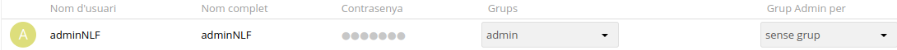

**4.2.-** Inicia sessió com a l'usuari adminXYZ.

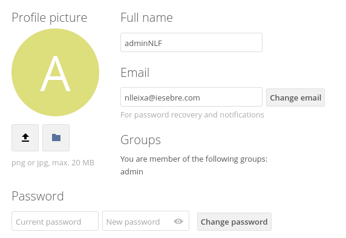

**4.3.-** Crea un usuari XYZ on XYZ son les inicials del company/a i afegeix-lo al grup usuaris, aquest usuari tindrà una quota de 512 MB.

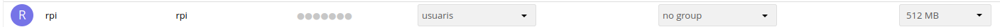

**4.4.-** Podem crear fitxers d'una mida determinada a Linux amb la comanda:

```
truncate -s 10M file.txt
```

A l'exemple es crea un fitxer de 10MB.

Crea 6 fitxers de 100MB i pujal's a Owncloud un per un.


**4.5.-** Mostra el missatge d'error per haver superat la quota d'usuari.


**4.6.-** Busca al teu perfil quin percentatge de quota estas utilitzant.

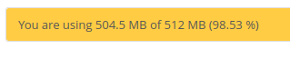

**4.7.-** Canvia la quota de l'usuari a 1GB i mostra tots els fitxers pujats.

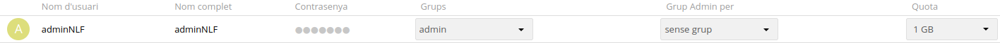

**4.8.-** Crea un usuari anomenat usuari2XYZ i fical al grup usuaris.

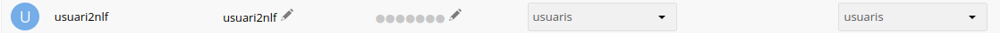

**4.9.-** Comparteix un fitxer de usuariXYZ a usuari2XYZ i mostra com l'usuari2XYZ pot veure i descarregar el fitxer.

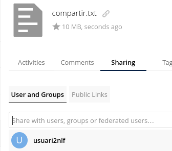
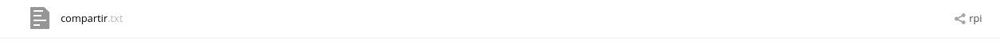

**4.10.-** Esborra la carpeta Learn more about owncloud.

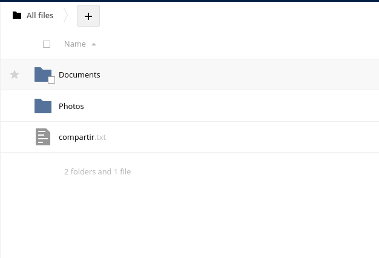

**4.11.-** Recupera la carpeta Learn more about owncloud.

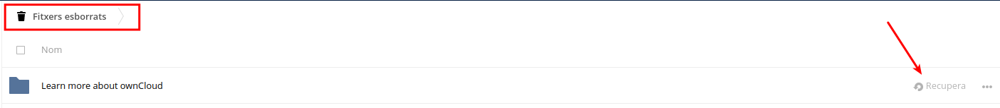

**4.12.-** Com a usuariXYZ crea una carpeta nova anomenada shared i comparteix-la amb l'usuari usuari2XYZ.

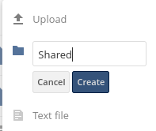

**4.13.-** Entra a Market instal·la dues aplicacions que no estiguin ja instal·lades i explica què fan i com funcionen.

**PRIMERA APP**
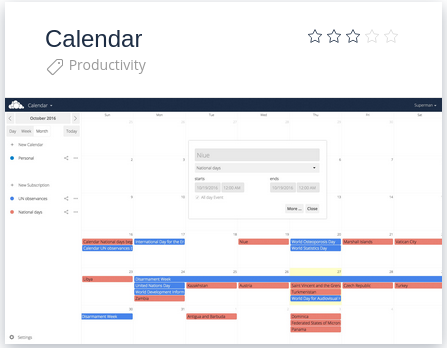

L'aplicació Calendar és una interfície d'usuari per al servidor CalDAV d'ownCloud. Ens permet sincronitza fàcilment esdeveniments de diversos dispositius amb el teu ownCloud i editar-los en línia.

Funcionament:

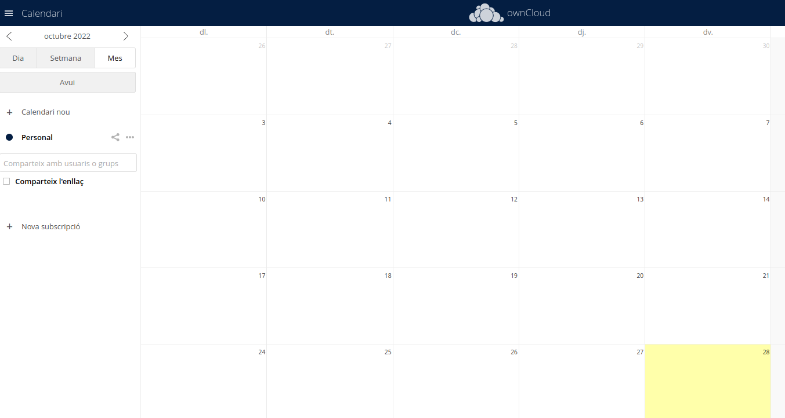

Aquesta funciona com un calendari normal amb la diferència que el podem compartir amb altres usuaris del servidor i també ens permet sincronitzar-lo amb eltres dispositius.

**SEGONA APP**

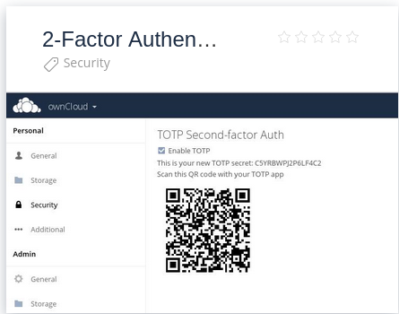

Aquesta aplicació ens permetra posar un sistema de doble autetificació al nostre compte. Funciona vinculant el compte a un altre dispositiu, que quant al que quant algú intenti iniciar sessió al compte de owncloud vincula, rebrà un correu amb un codi de verificació per fer el compte mes segur.

**4.14.-** Crearem una carpeta nova per emmagatzematge a Owncloud, la carpeta serà /media/publicXYZ on XYZ són les teves inicials i apareixerà amb el nom de public als usuaris.

Aquesta carpeta haurà de pertànyer a l'usuari www-data.

**RESPOSTA**

**4.15.-** Connectarem la carpeta publicXYZ com emmagatzematge local, tal i com s'indica [aquí](https://doc.owncloud.com/server/next/admin_manual/configuration/files/external_storage/local.html). Tots els usuaris tindran accés a la carpeta.

**RESPOSTA**

**4.16.-** Un usuari normal pujarà un fitxer a la carpeta public.

**RESPOSTA**

**OPCIONAL.-** Aquesta tasca és opcional.

Intenta connectar com a emmagatzematge extern el teu compte de Google Drive de l'Institut. Tens com fer-ho [aquí](https://doc.owncloud.com/server/next/admin_manual/configuration/files/external_storage/google.html).

**RESPOSTA**

